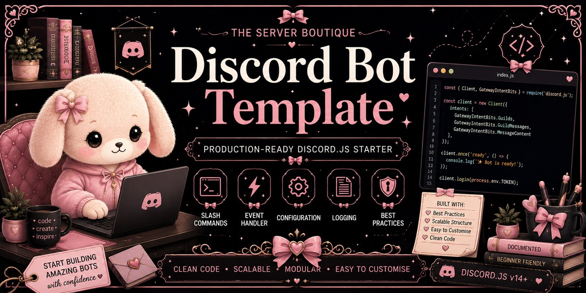

<p align="center">
  
</p>

<div align="center">

# 🤖 Discord Bot Template

### Production-Ready Discord.js Starter


A clean, scalable and production-ready **Discord.js v14** starter template.

Built to help developers create modern Discord bots using a modular architecture and development best practices.

</div>

---

# 🌸 Overview

The **Discord Bot Template** is an open-source starter project created and maintained by **The Server Boutique**.

Instead of beginning every Discord bot from scratch, this template provides a clean project structure, organised folders and modern development practices that make new projects faster to build and easier to maintain.

Whether you're creating a small community bot or a large production application, this template provides a strong foundation.

---

# ✨ Features

- 🤖 Discord.js v14
- ⚡ Slash command ready
- 📂 Modular folder structure
- 🧩 Event-driven architecture
- ⚙️ Environment variable support
- 📝 Configuration system
- 📜 Logging support
- 🛡️ Best-practice project structure
- 📚 Beginner-friendly organisation
- ♻️ Easy to extend and customise
- 🧪 Built with testing in mind
- 📖 Fully documented

---

# 📂 Project Structure

```text
discord-bot-template/
│
├── docs/
├── examples/
├── src/
│   ├── commands/
│   ├── config/
│   ├── events/
│   ├── handlers/
│   ├── utils/
│   └── index.js
│
├── tests/
├── .env.example
├── CHANGELOG.md
├── CODE_OF_CONDUCT.md
├── CONTRIBUTING.md
├── LICENSE
├── README.md
├── SECURITY.md
└── package.json
```

---

# 🚀 Getting Started

Clone the repository

```bash
git clone https://github.com/theserverboutique/discord-bot-template.git
```

Install dependencies

```bash
npm install
```

Rename

```text
.env.example
```

to

```text
.env
```

Add your bot token and configuration values.

Start the bot

```bash
npm start
```

---

# 📦 Included Components

| Component | Description |
|-----------|-------------|
| 🤖 Slash Commands | Ready for command development |
| ⚡ Events | Modular event loading |
| ⚙️ Configuration | Centralised configuration files |
| 📂 Handlers | Clean loading architecture |
| 🧰 Utilities | Shared helper functions |
| 🌱 Environment | Secure `.env` configuration |
| 📜 Logging | Structured console logging |
| 🛡️ Best Practices | Clean project organisation |

---

# 🎯 Project Goals

This template is designed to:

- Encourage clean project architecture.
- Reduce repetitive setup.
- Provide a scalable starting point.
- Follow modern Discord.js conventions.
- Help developers learn good project structure.
- Remain lightweight and easy to customise.

---

# 🗺️ Roadmap

## 🚧 Current

- Slash command handler
- Event handler
- Configuration system
- Environment variables
- Basic utilities
- Logging
- Documentation

## 🔮 Planned

- Permission framework
- Command cooldown system
- Database examples
- Component handler
- Error management improvements
- TypeScript edition
- CI workflows
- Expanded documentation

---

# 🧪 Development

This repository is intended to become the recommended starting point for projects built by **The Server Boutique**.

Future releases will continue improving scalability, documentation and developer experience while remaining beginner friendly.

---

# 🤝 Contributing

Contributions, bug reports and feature suggestions are always welcome.

Please read **CONTRIBUTING.md** before opening a pull request.

---

# 📄 License

Released under the **MIT License**.

See **LICENSE** for full details.

---

# 🌸 About The Server Boutique

The Server Boutique is a boutique Discord development studio specialising in:

- 🤖 Custom Discord bots
- 🏡 Discord server design
- ⚙️ Community automation
- 📦 Open-source developer tools
- 📚 Documentation and community resources

If this template helps you, consider supporting future development or exploring our services.

### ☕

**Ko-fi**

https://ko-fi.com/theserverboutique

---

<div align="center">

### 🌸 Built with care by The Server Boutique

Beautiful communities • Thoughtful systems • Production-ready code

</div>
